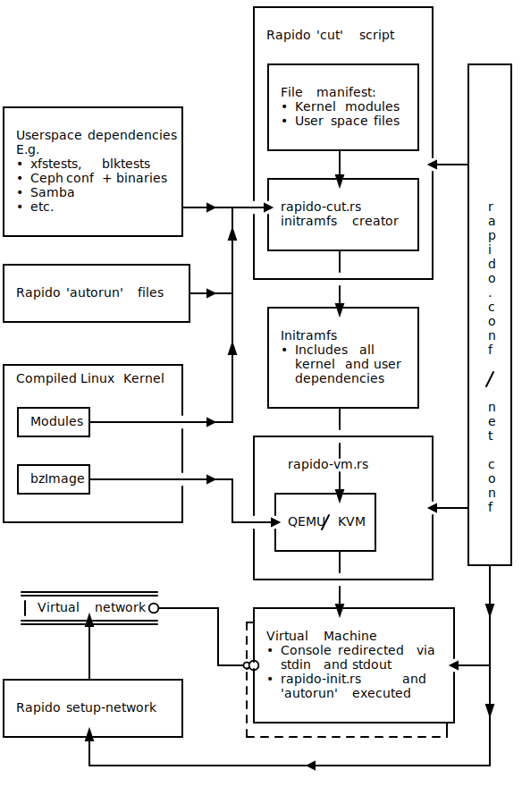

Rapido helps you quickly test Linux kernel changes.

The scripts that make up Rapido are in themselves quite brainless. Most
of the heavy lifting is instead performed by:

* [Dracut](https://dracut.wiki.kernel.org):
  * Generates a VM image, with kernel-modules and minimal user-space
* [QEMU](http://qemu.org):
  * Boots a given Dracut VM image and compiled Linux kernel on the local
    system
* [systemd-networkd](https://www.freedesktop.org/wiki/Software/systemd/):
  * Configures networking within Rapido VMs (optional)
* [iproute2](https://wiki.linuxfoundation.org/networking/iproute2):
  * Configures Bridge and TAP devices on the host (optional)

Dependencies are obtained from the local system; no magic images or
internet downloads are necessary.


## Setup

Once the dependencies listed above have been installed, Rapido can be
configured via [rapido.conf](rapido.conf.example). At a minimum, the
Linux kernel source parameters should be defined.

### Network Configuration

Test VM images may be "cut" with or without network support. For
networking, per-VM systemd-networkd configuration should be specified in
the `net-conf` directory. An example is provided in
[net-conf.example](net-conf.example).
The `rapido setup-network` command should be run as root to configure a
bridge network device and VM-assigned tap devices.
By default, the bridge network is isolated, and isn't connected to any
physical adapters.


## Running

Depending on which kernel component or functionality you'd like to test,
choose a `cut` script to generate a VM image. E.g.
```shell
./rapido cut fstests-btrfs
```

The cut script collects all required kernel modules and user-space dependencies
from the local system and writes a VM initramfs image to `initrds/myinitrd`.
Once generated, a VM using the image and kernel will boot immediately.
Subsequent VMs can be booted manually via:
```shell
./rapido boot
```


## Adding Your Own Tests

Rapido can be easily extended to test any kernel functionality of
interest. Simply copy the [cut/simple_example.sh](cut/simple_example.sh)
and [autorun/simple_example.sh](autorun/simple_example.sh) scripts and
modify them to suit your needs.
The example scripts are fully annotated.


## Feedback and Bug Reporting

Please raise any questions or issues upstream via
<https://github.com/rapido-linux/rapido/issues>


## Architecture


<details>
<summary>ASCII art</summary>

```
                                   +------------------------+
                                   |                        |
                                   | Rapido 'cut' script    |
                                   |                        |
                                   | +--------------------+ |    +-----+
                                   | |                    | |    |     |
                                   | | File manifest:     | |    |     |
+------------------------+         | | • Kernel modules   | |    |     |
|                        |         | | • User space files | |    |     |
| Userspace dependencies |         | |                    | |    |     |
| E.g.                   |         | +---------+----------+ |    |     |
| • xfstests, blktests   |         |           |            <----+     |
| • Ceph conf + binaries |         | +---------v----------+ |    |     |
| • Samba                |         | |                    | |    |     |
| • etc.                 +--->--+---->  Dracut initramfs  | |    |  r  |
|                        |      |  | |  generator         | |    |  a  |
+------------------------+      ^  | |                    | |    |  p  |
                                |  | +---------+----------+ |    |  i  |
+-------------------------+     |  |           |            |    |  d  |
|                         |     |  +------------------------+    |  o  |
| Rapido 'autorun' script +-->--+              |                 |  .  |
|                         |     |    +---------v----------+      |  c  |
+-------------------------+     |    |                    |      |  o  |
                                |    | Initramfs          |      |  n  |
                                ^    | • Includes all     |      |  f  |
+------------------------+      |    |   kernel and user  |      |     |
| Compiled Linux Kernel  |      |    |   dependencies     |      |  /  |
|                        |      |    |                    |      |     |
| +---------+            |      |    +---------+----------+      |  n  |
| | Modules +---------------->--+              |                 |  e  |
| +---------+            |         +------------------------+    |  t  |
|                        |         |           |            |    |     |
| +---------+            |         |  Rapido 'vm' script    |    |  c  |
| | bzImage +---------------->--+  |           |            |    |  o  |
| +---------+            |      |  |  +--------v----+       |    |  n  |
|                        |      |  |  |             |       <----+  f  |
+------------------------+      +-----> QEMU / KVM  |       |    |     |
                                   |  |             |       |    |     |
                                   |  +--------+----+       |    |     |
                                   |           |            |    +--+--+
                                   +------------------------+       |
   ===================                         |                    |
   | Virtual network O--------+    +-----------v---------------+    v
   =========^=========        |   ++                           |    |
            |                 |   !| Virtual Machine           |    |
            |                 |   !| • Console redirected via  |    |
            |                 +---oO   stdin and stdout        <----+
+-----------+------------+        !| • 'autorun' script        |    |
|                        |        !|   executed on boot        |    |
| Rapido "setup-network" |        !|                           |    v
|                        |        !+--------------------------++    |
+-----------^------------+        +~~~~~~~~~~~~~~~~~~~~~~~~~~~+     |
            |                                                       |
            +------------------------------<------------------------+
```
</details>
